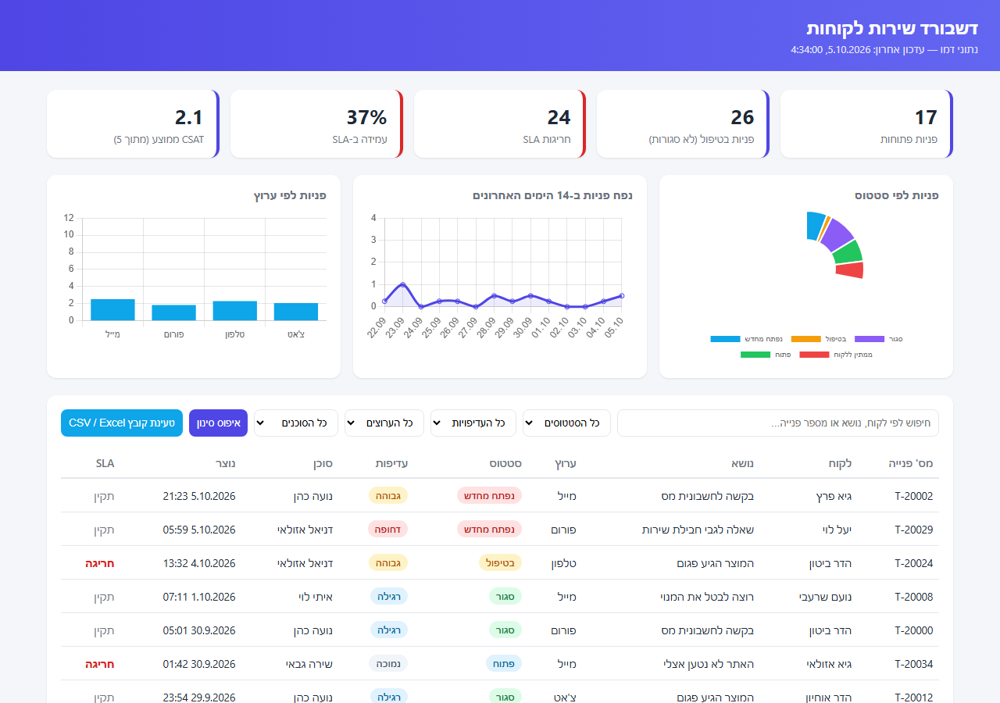

# Customer Service Dashboard

Repo: https://github.com/kagan1311-lea/customer-service-dashboard

Live demo (GitHub Pages): https://kagan1311-lea.github.io/customer-service-dashboard/

A static, single-page dashboard for visualizing customer service tickets. Hebrew (RTL) UI, built with vanilla HTML/CSS/JS and [Chart.js](https://www.chartjs.org/). Ticket data is loaded live from a [Supabase](https://supabase.com/) (Postgres) database via its public client API (read-only, anon key).



## Features

- KPI summary cards
- Charts: tickets by status, 14-day ticket volume, tickets by channel
- Ticket table with search and filters (status, priority, channel, agent)
- Ticket detail modal

## Getting started

No build step or dependencies to install — just open `index.html` in a browser, or serve the folder with any static file server:

```bash
npx serve .
```

An internet connection is required to load ticket data from Supabase.

The page re-fetches and re-renders from Supabase automatically every 5 minutes while it stays open (current filters/search are preserved), in addition to loading on page load. To keep the demo data feeling alive, it is also regenerated server-side every 15 minutes via a `pg_cron` job in Supabase (scoped to run until 2026-10-06 19:00 Asia/Jerusalem); the client-side refresh itself is permanent app behavior.

## Project structure

- `index.html` — page markup
- `style.css` — styling
- `data.js` — Supabase client and ticket data loading
- `app.js` — dashboard logic (rendering, filtering, charts)
